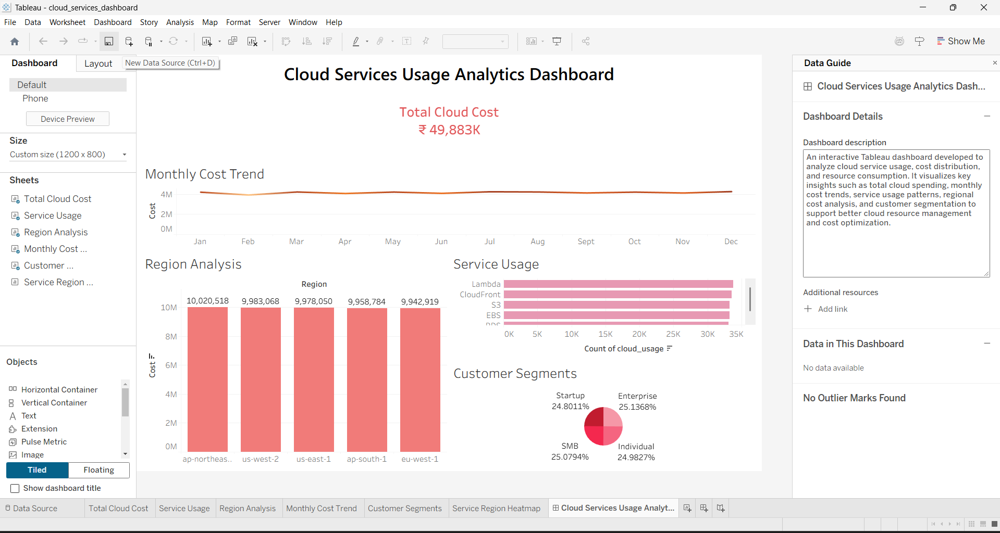

# Cloud Services Usage Analytics Dashboard

This project analyzes cloud service usage and cost patterns using SQL and Tableau.

## Tools Used
- MySQL
- Tableau
- SQL
- Data Visualization

## Key Insights
- Total Cloud Spending
- Monthly Cost Trends
- Service Usage Analysis
- Regional Cost Distribution
- Customer Segment Analysis

## Dashboard

## Project Structure
dataset/ – Cloud usage dataset  
sql/ – SQL queries used for analysis  
dashboard/ – Tableau dashboard file  
images/ – Dashboard screenshots

## Author
Sonali Singh